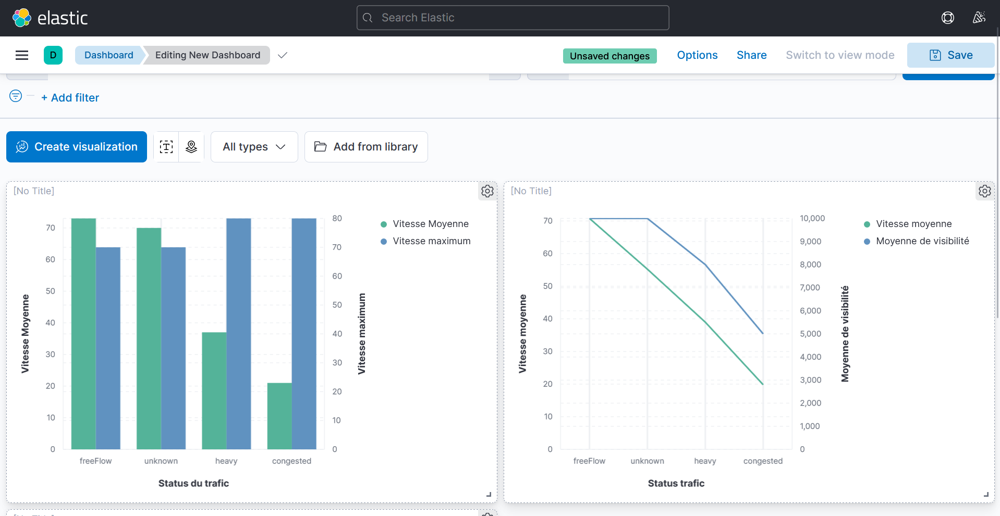

# Projet Intégré : Etat du trafic rennais en fonction de la météo

## Technologies Utilisées

### Langage


### Frameworks et Outils de Développement


### Cloud & Bases de Données


### Bibliothèques de Données & Machine Learning


### Outils de Visualisation


### Conteneurisation et Déploiement


### Outils de Débogage et de Terminal


---
Ces outils ont été utilisés pour le développement du projet sur l'état du trafic rennais, visant à ingérer, transformer, et analyser les données du trafic en temps réel pour obtenir des informations sur les habitudes des usagers et repérer les heures d'affluence ainsi qu'analyser pour savoir si le trafic est influencé par la météo ou non. Le traitement des données en temps réel est facilité par des dags Airflow, ensuite nos données ont été intégrés dans un DataLake sous MongoDB. Ces données ont par la suite été traités sous python, avant d'être importés dans Kibana pour les utiliser dans des visualisations. 

## Objectif du Projet
Ce projet vise à analyser l’impact des conditions météorologiques et des niveaux de pollution sur le trafic routier afin de proposer des solutions pour améliorer la gestion de la mobilité, réduire les congestions et limiter les risques d’accidents. Ce projet nous amène donc à nous demander : 
En quoi les conditions météorologiques et les niveaux de pollution influencent-ils le trafic routier ?


## 🎭 Mes cibles

Mes cibles principales incluent :

- **Métropole rennaise** qui souhaitent suivre si les routes sont plus ou moins empruntés certains jours ou non afin de pouvoir améliorer la mobilité urbaine. De plus, comme les données concernant le trafic rennais sont mis en lien avec la météo, la métropole pourra également connaître les impacts de la météo sur leurs routes et le trafic et prendre des mesures afin de limiter le nombre d'accidents.

- **Analystes de Données et Chercheurs** qui souhaitent étudier les conséquences de circonstances extérieurs tel que la météo sur le trafic rennais.

## Architecture du Projet 

```
.
├── Airflow
│   ├── docker-compose.yml
│   ├── requirements.txt+
│   ├── dags
│       ├── dag.py
│   ├── script
│       ├── entrypoint.sh
├── data_collection
│   ├── getAPI.py
├── ELK
│   ├── docker-compose.yml
│   └── import_to_elasticsearch.py
├── ENV
│   ├── bin
│   ├── etc
│   ├── include
│   ├── lib
│   ├── lib64 -> lib
│   ├── Scripts
│       ├── activate.bat
│       ├── API_meteo.py
│       ├── API_pollution.py
│       ├── connexion_mongodb.py
│       ├── creation_traitement_csv.py
│   ├── pyvenv.cfg
├── .env
├── .gitignore
├── dag.png
├── elasticsearch.png
├── kibana.png
├── schema.png
├── README.md
```


### Workflow et Schéma d'Architecture

1. **Ingestion des Données de l'Etat du trafic rennais** :
   - Extraction des données sur l'Etat du trafic Rennais en temps réel via l'API "Etat du trafic en temps réel" disponible sur le site data rennes métropole puis envoi des données dans Mongo DB.

2. **Ingestion des données Météo** :
   - Extraction des données météo via l'API disponible sur Open Weather Data puis envoi des données dans Mongo DB.

3. **Traitement des Données** :
   - **Transformation des Données** : Dans un programme python, on va chercher nos données présentes dans nos collections mongoDB et on les ressort sous la forme d'un fichier CSV. Dans ce même programme, on traite nos données pour avoir des variables nécessaires à nos visualisations et des données propres. Par la suite, on a fusionné nos deux fichiers d'API en un seul fichier pour faciliter les visualisations.

4. **Indexation et Stockage** :
   - Notre fichier de données est ensuite stockées dans ElasticSearch, indexées par date.

5. **Visualisation et Analyse** :
   - Kibana est utilisé pour créer des tableaux de bord interactifs, permettant de suivre l'état du trafic rennais en fonction de la météo.

## Fonctionnalités du Projet

1. **Suivi de l'état du trafic Rennais**
   - **Objectif** : Suivre l'état du trafic rennais avant de connaître les jours et heures d'affluence.
   - **Description** : Il est important de suivre l'état du trafic afin de pouvoir l'améliorer en proposant des déviations aux usagers en cas de forte affluence, ce qui permet de limiter le risque d'accidents et de sur-accidents qui ont entraînés les jours de forte affluence.

2. **Corrélation entre l'état du trafic Rennais et la météo sur une même période**
   **Objectif** : Analyser l’impact des conditions météorologiques et des niveaux de pollution sur le trafic routier afin de proposer des solutions pour améliorer la gestion de la mobilité, réduire les congestions et limiter les risques d’accidents.
   - **Description** : Les conditions météorologiques et la pollution influencent directement le trafic routier, impactant la sécurité, la fluidité et les comportements des usagers. Analyser ces interactions permettrait d’optimiser la gestion de la mobilité urbaine.


## Déroulement Technique du Projet

### **Étapes d'installation :**

1. **Cloner le dépôt :**
   ```bash
   git clone https://github.com/Coline-T/Transports_meteo
   cd Transports_meteo
   ```

2. **Créer un environnement virtuel :**
   ```bash
   python -m venv venv
   source venv/bin/activate  # Unix
   # Ou
   venv\Scripts\activate     # Windows
   ```

3. **Installer les dépendances :**
   ```bash
   pip install -r requirements.txt
   ```

**Configurer les variables d'environnement :**
   Créez un fichier `.env` et renseignez les informations de connexion MongoDB , OPENAI , le topic kafka , le lien de l'api et Elasticsearch :
   ```env
MONGO_USERNAME="******"
MONGO_PASSWORD="******"
MONGO_DBNAME="*******"
MONGO_URI="*********"
API_URL=https://data.rennesmetropole.fr/api/explore/v2.1/catalog/datasets/etat-du-trafic-en-temps-reel/records
OPENAI_API_KEY="*******"
KAFKA_BROKER=localhost:9092"******"
KAFKA_TOPIC="*******"
   ```

### Sous-Projet : Ingestion et Préparation des Données

Cette partie du projet est un sous-projet spécifique à l'ingestion et à la préparation des données, inclus dans notre projet global Transports_Meteo.

### Extraction et Ingestion
   - **Données des différents API** : Extraction des données sanitaires avec Python et envoi dans MongoDB.

### Traitement des données
   - **Traitement des données sous Python** : Les données stockées dans MongoDB sont traités et transformés sous python.

### Stockage et Indexation avec Elasticsearch
   - Stockage des données des transports rennais, des données météo et des données de la pollution de l'air dans Elasticsearch.

### Visualisation avec Kibana
   - Création de tableaux de bord pour :
      - Mesure de l'affluence (voir si le trafic est plus souvent bouché ou libre)
      - Analyser la vitesse et le type du trafic en temps de pluie
      - ...

## Analyses et Indicateurs Attendus ---> A FAIRE

1. **...** : ...
2. **...** : ...
3. **...** : ...
4. **...** : ...

## Exemples de Cas d'Usage

- **Pour la métropole rennaise** : Suivre l'état du trafic rennais pour connaître les périodes où les routes sont le plus empruntés, tout en mettant ses données en lien avec la météo du moment afin de pouvoir améliorer la mobilité urbaine mais aussi réduire le nombre d'accidents.
- **Pour les usagers des routes** : Les usagers pourront connaître les moments où il est déconseillé d'emprunter certaines routes car bouché mais aussi connaître les impacts de la météo sur le trafic. 
- **Pour les analystes** : Suivre les conséquences de circonstances extérieurs tel que la météo sur le trafic rennais.

## Déploiement

- **Docker** : Conteneurisation des services (Elasticsearch, Kibana) pour simplifier le déploiement.
- **Configurations** : Variables d’API et paramètres de stockage configurables via des fichiers `.env`.
- **Automatisation** : Script de déploiement pour exécuter le pipeline complet.


## Visualisation des Données avec Kibana

Les données collectées et importées dans Elasticsearch  sont visualisées dans Kibana pour une analyse approfondie. Voici un aperçu de certaines visualisations créées pour explorer les avis clients et leurs sentiments.




##  📜 Conclusion <a name="conclusion"></a>

L'application Realtime Restaurant Insights s'est avérée être un atout considérable pour les acteurs de la restauration cherchant à comprendre et à exploiter les retours clients en temps réel. Grâce à l'intégration harmonieuse d'outils tels que Kafka pour l’ingestion de données en temps réel, Apache Spark pour le traitement, et Elasticsearch et Kibana pour l’indexation et la visualisation, l'application permet une exploitation rapide et efficace des données critiques.

Cette solution offre aux restaurateurs une capacité inédite de suivre la satisfaction client, d’identifier les problématiques de manière proactive, et de mettre en œuvre des actions correctives immédiates. Les gestionnaires de chaînes peuvent obtenir une vue d’ensemble de leurs multiples établissements, facilitant une gestion centralisée tout en gardant un œil sur chaque restaurant. Cette vision consolidée améliore non seulement la qualité du service, mais permet aussi une prise de décision fondée sur des informations vérifiées et actuelles.

En utilisant l’API d’OpenAI pour analyser les sentiments des avis clients, l'application est capable de transformer de simples commentaires en indicateurs concrets, fournissant des insights sur les aspects positifs et négatifs du service et des produits. Cela aide non seulement à rehausser l'expérience client, mais permet également aux équipes marketing d’orienter leurs stratégies de manière plus personnalisée et pertinente.

Les fonctionnalités de visualisation des données, avec Kibana, apportent une dimension interactive qui permet de transformer des volumes importants de données en tableaux de bord intuitifs. Ces visualisations permettent aux utilisateurs d'explorer les tendances, de suivre la satisfaction des clients en temps réel, et de prendre des décisions éclairées.

En somme, l’application "Realtime Restaurant Insights" se positionne comme un outil essentiel pour quiconque souhaite rester compétitif dans le secteur de la restauration. Elle aide à optimiser la satisfaction client, améliorer la qualité des services, et exploiter les retours clients de manière constructive. En mettant la donnée au centre de la prise de décision, cette solution représente une avancée majeure vers une gestion proactive et axée sur les résultats pour le secteur de la restauration.


🚧 Difficultés Rencontrées

- **...** 
....


**Airflow**  est utilisé pour orchestrer les pipelines de collecte de données via des DAGs. Un exemple de DAG est utilisé pour envoyer nos données de MongoDB vers Kafka. Ce script Airflow s'exécute toutes les 8 heures. Voici une images du  DAG :


## Contributeurs

- Solenn COULON (@solennCoulon17): Data engineer -**solenn.coulon@supdevinci-edu.fr**
- Coline TREILLE (@Coline-T) : Data analyst -**coline.treille@supdevinci-edu.fr**


## Licence

Ce projet est sous licence MIT. N'hésitez pas à utiliser et modifier le code pour vos propres projets.