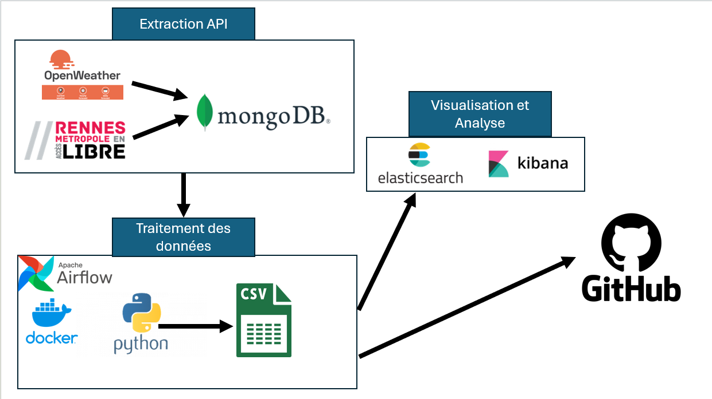
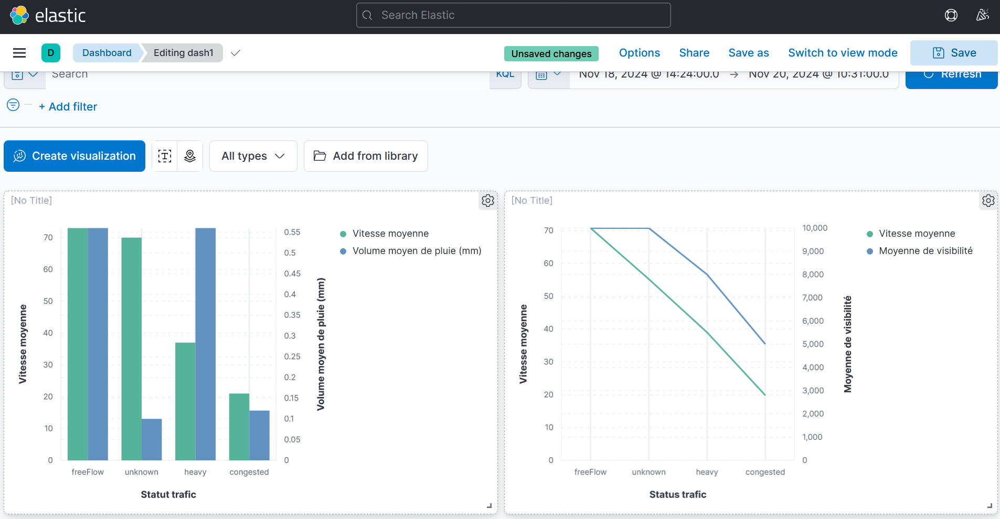

# Projet Intégré : Etat du trafic rennais en fonction de la météo

## Technologies Utilisées

### Langage


### Frameworks et Outils de Développement


### Cloud & Bases de Données


### Bibliothèques de Données & Machine Learning


### Outils de Visualisation


### Conteneurisation et Déploiement


### Outils de Débogage et de Terminal


---
Ces outils ont été utilisés pour le développement du projet sur l'état du trafic rennais, visant à ingérer, transformer, et analyser les données du trafic en temps réel pour obtenir des informations sur les habitudes des usagers et repérer les heures d'affluence ainsi qu'analyser pour savoir si le trafic est influencé par la météo ou non. Le traitement des données en temps réel est facilité par des dags Airflow, ensuite nos données ont été intégrés dans un DataLake sous MongoDB. Ces données ont par la suite été traités sous python, avant d'être importés dans Kibana pour les utiliser dans des visualisations. 

## Objectif du Projet
Ce projet vise à analyser l’impact des conditions météorologiques et des niveaux de pollution sur le trafic routier afin de proposer des solutions pour améliorer la gestion de la mobilité, réduire les congestions et limiter les risques d’accidents. L'objectif serait de pouvoir proposer une solution à Rennes métropole afin de prédire les prochains problèmes de mobilité sur les 5 prochains jours. 
Ce projet nous amène donc à nous demander : En quoi les conditions météorologiques influencent-ils le trafic routier ?

## 🎭 Mes cibles

Mes cibles principales incluent :

- **Métropole rennaise** qui souhaitent suivre si les routes sont plus ou moins empruntés certains jours ou non afin de pouvoir améliorer la mobilité urbaine. De plus, comme les données concernant le trafic rennais sont mis en lien avec la météo, la métropole pourra également connaître les impacts de la météo sur leurs routes et le trafic et prendre des mesures afin de limiter le nombre d'accidents.

- **Analystes de Données et Chercheurs** qui souhaitent étudier les conséquences de circonstances extérieurs tel que la météo sur le trafic rennais.

## Architecture du Projet 

```
.
├── Airflow
│   ├── docker-compose.yml
│   ├── requirements.txt
│   ├── dags
│       ├── dag.py
│   ├── script
│       ├── entrypoint.sh
├── data_collection
│   ├── getAPI.py
├── ELK
│   ├── docker-compose.yml
│   └── import_to_elasticsearch.py
├── ENV
│   ├── bin
│   ├── etc
│   ├── include
│   ├── lib
│   ├── lib64 -> lib
│   ├── Scripts
│       ├── activate.bat
│       ├── API_meteo.py
│       ├── API_pollution.py
│       ├── connexion_mongodb.py
│       ├── creation_traitement_csv.py
│   ├── pyvenv.cfg
├── .env
├── .gitignore
├── elasticsearch.png
├── tableau_de_bord.png
├── schema.png
├── README.md
```


### Workflow et Schéma d'Architecture

1. **Ingestion des Données de l'Etat du trafic rennais** :
   - Extraction des données sur l'Etat du trafic Rennais en temps réel via l'API "Etat du trafic en temps réel" disponible sur le site data rennes métropole puis envoi des données dans Mongo DB.

2. **Ingestion des données Météo** :
   - Extraction des données météo via l'API disponible sur Open Weather Data puis envoi des données dans Mongo DB.

3. **Traitement des Données** :
   - **Transformation des Données** : Dans un programme python, on va chercher nos données présentes dans nos collections mongoDB et on les ressort sous la forme d'un fichier CSV. Dans ce même programme, on traite nos données pour avoir des variables nécessaires à nos visualisations et des données propres. Par la suite, on a fusionné nos deux fichiers d'API en un seul fichier pour faciliter les visualisations.

4. **Indexation et Stockage** :
   - Notre fichier de données est ensuite stockées dans ElasticSearch, indexées par date.

5. **Visualisation et Analyse** :
   - Kibana est utilisé pour créer des tableaux de bord interactifs, permettant de suivre l'état du trafic rennais en fonction de la météo.

## Fonctionnalités du Projet

1. **Suivi de l'état du trafic Rennais**
   - **Objectif** : Suivre l'état du trafic rennais avant de connaître les jours et heures d'affluence.
   - **Description** : Il est important de suivre l'état du trafic afin de pouvoir l'améliorer en proposant des déviations aux usagers en cas de forte affluence, ce qui permet de limiter le risque d'accidents et de sur-accidents qui ont entraînés les jours de forte affluence.

2. **Corrélation entre l'état du trafic Rennais et la météo sur une même période**
   **Objectif** : Analyser l’impact des conditions météorologiques et des niveaux de pollution sur le trafic routier afin de proposer des solutions pour améliorer la gestion de la mobilité, réduire les congestions et limiter les risques d’accidents.
   - **Description** : Les conditions météorologiques et la pollution influencent directement le trafic routier, impactant la sécurité, la fluidité et les comportements des usagers. Analyser ces interactions permettrait d’optimiser la gestion de la mobilité urbaine.


## Déroulement Technique du Projet

### **Étapes d'installation :**

1. **Cloner le dépôt :**
   ```bash
   git clone https://github.com/Coline-T/Transports_meteo
   cd Transports_meteo
   ```

2. **Créer un environnement virtuel :**
   ```bash
   python -m venv venv
   source venv/bin/activate  # Unix
   # Ou
   venv\Scripts\activate     # Windows
   ```

3. **Installer les dépendances :**
   ```bash
   pip install -r requirements.txt
   ```

**Configurer les variables d'environnement :**
   Créez un fichier `.env` et renseignez les informations de connexion MongoDB , OPENAI , le topic kafka , le lien de l'api et Elasticsearch :
   ```env
MONGO_USERNAME="******"
MONGO_PASSWORD="******"
MONGO_DBNAME="*******"
MONGO_URI="*********"
API_URL=https://data.rennesmetropole.fr/api/explore/v2.1/catalog/datasets/etat-du-trafic-en-temps-reel/records
API_KEY_pollution='*********'
URL_Met=f'https://api.openweathermap.org/data/2.5/forecast?lat=48.1113387&lon=-1.6800198&appid=*********'
URL_Pol=f'http://api.openweathermap.org/data/2.5/air_pollution?lat=48.1115&lon=-1.678&appid=************'
API_KEY_MET='*********'
   ```

### Sous-Projet : Ingestion et Préparation des Données

Cette partie du projet est un sous-projet spécifique à l'ingestion et à la préparation des données, inclus dans notre projet global Transports_Meteo.

### Extraction et Ingestion
   - **Données des différents API** : Extraction des données sanitaires avec Python et envoi dans MongoDB.

### Traitement des données
   - **Traitement des données sous Python** : Les données stockées dans MongoDB sont traités et transformés sous python.

### Stockage et Indexation avec Elasticsearch
   - Stockage des données des transports rennais, des données météo et des données de la pollution de l'air dans Elasticsearch.

### Visualisation avec Kibana
   - Création de tableaux de bord pour :
      - Analyser la vitesse moyenne des usagers en fonction du statut du trafic et du niveau moyen de la pluie
      - Analyser la vitesse moyenne des usagers en fonction du statut du trafic et du niveau de visibilité moyen

## Analyses et Indicateurs Attendus 

1. **Vitesse moyenne en fonction du statut du trafic et du niveau de la pluie** 
2. **Vitesse moyenne en fonction du statut du trafic et du niveau de visibilité moyenne** 

## Exemples de Cas d'Usage

- **Pour la métropole rennaise** : Suivre l'état du trafic rennais pour connaître les périodes où les routes sont le plus empruntés, tout en mettant ses données en lien avec la météo du moment afin de pouvoir améliorer la mobilité urbaine mais aussi réduire le nombre d'accidents.
- **Pour les usagers des routes** : Les usagers pourront connaître les moments où il est déconseillé d'emprunter certaines routes car bouché mais aussi connaître les impacts de la météo sur le trafic. 
- **Pour les analystes** : Suivre les conséquences de circonstances extérieurs tel que la météo sur le trafic rennais.

## Déploiement

- **Docker** : Conteneurisation des services (Elasticsearch, Kibana) pour simplifier le déploiement.
- **Configurations** : Variables d’API et paramètres de stockage configurables via des fichiers `.env`.
- **Automatisation** : Script de déploiement pour exécuter le pipeline complet.


## Visualisation des Données avec Kibana

Les données collectées et importées dans Elasticsearch  sont visualisées dans Kibana pour une analyse approfondie. Voici un aperçu de certaines visualisations créées pour explorer les avis clients et leurs sentiments.



##  📜 Conclusion <a name="conclusion"></a>

Ce projet a montré que les conditions météorologiques influencent le trafic routier. L'analyse de ces facteurs permet de mieux comprendre les pics de congestion et les comportements des conducteurs, offrant ainsi des pistes pour améliorer la gestion du trafic, réduire les risques d'accidents et favoriser une mobilité plus durable.​

🚧 Difficultés Rencontrées

- **Format de l'API** 
   Difficultés rencontrées lors de la récupération des données.
- **Utilisation de nouveau logiciel**
   Nous avons rencontré 5 nouveaux logiciels, ce qui nous a fait perdre beaucoup de temps comme nous avons du comprendre  leurs fonctionnements.


**Airflow**  est utilisé pour orchestrer les pipelines de collecte de données via des DAGs. On a voulu créer un DAG nous permettant d'aller extraire nos données de l'API, de les importer dans MongoDB puis de les extraire sous CSV. 

## Contributeurs

- Solenn COULON (@solennCoulon17): Data engineer -**solenn.coulon@supdevinci-edu.fr**
- Coline TREILLE (@Coline-T) : Data analyst -**coline.treille@supdevinci-edu.fr**


## Licence

Ce projet est sous licence MIT. N'hésitez pas à utiliser et modifier le code pour vos propres projets.